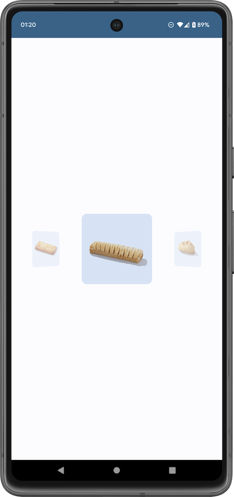

# Jetpack Compose Horizontal Pager Animation Demo

<p align="center">
  
</p>

This is a demo app demonstrating the official Jetpack Compose Horizontal Pager.

In this app, you can see how simple we can set up a Horizontal Pager apply animations.

No more custom views, fragments and complex lifecycle handling!

## Animations

The page animations are all down using the `graphicsLayer` modifier at the page composable. It calculates the offset of that specific page relative to the current active page, and apply transformations.

```
 Card(
        modifier = modifier
            .graphicsLayer {
                val pageOffset = (
                        (pagerState.currentPage - thisPageIndex) + pagerState
                            .currentPageOffsetFraction
                        )

                alpha = lerp(
                    start = 0.4f,
                    stop = 1f,
                    fraction = 1f - pageOffset.absoluteValue.coerceIn(0f, 1f),
                )

                cameraDistance = 8 * density
                rotationY = lerp(
                    start = 0f,
                    stop = 40f,
                    fraction = pageOffset.coerceIn(-1f, 1f),
                )

                lerp(
                    start = 0.5f,
                    stop = 1f,
                    fraction = 1f - pageOffset.absoluteValue.coerceIn(0f, 1f),
                ).also { scale ->
                    scaleX = scale
                    scaleY = scale
                }
            }
    )
```

I am not a mathematician, and I am no longer having a mathematician coworker with me to play with this. There might have room for improvement. Feel free to optimise everything here to meet your needs.


## Just download and run it!

This project was created using Android Studio Giraffe | 2022.3.1 Canary 11.
